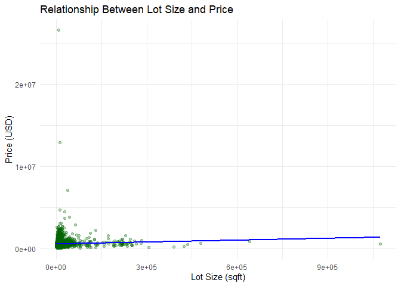
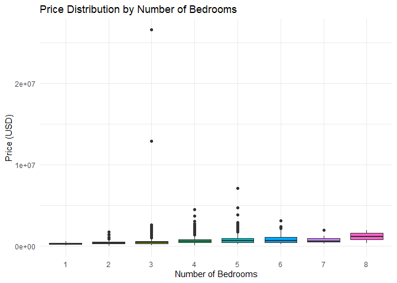
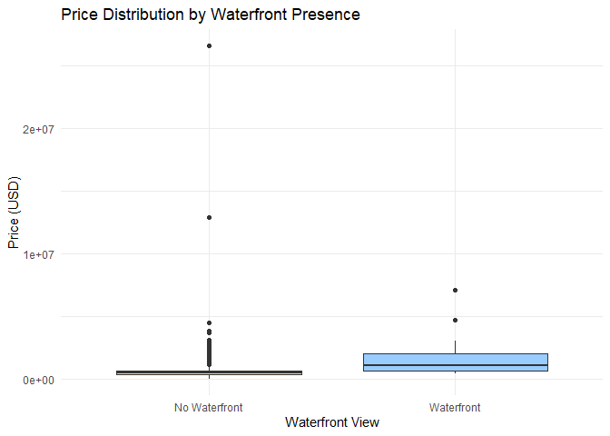
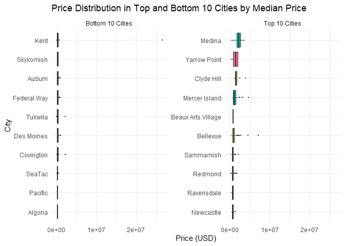

GETTING INTO REAL ESTATE BUSINESS IN THE US
================
Maurice otieno
2025-05-16

This project is geared towards extracting and analyzing data on housing
prices in the United States, with the aim of guiding individuals
interested in real estate investment. An in-depth understanding of
property pricing dynamics is essential for making data-driven decisions
that lead to profitable investments. This study examines three key
assumptions: (1) larger lot sizes and higher counts of bedrooms and
bathrooms are positively associated with property prices; (2) homes
featuring waterfront views tend to command premium sale values; and (3)
properties situated in more developed cities exhibit higher average
prices. These assumptions will be tested using statistical methods
applied to cleaned and structured data.

To support this analysis, a publicly available dataset from
[Kaggle](https://www.kaggle.com/datasets/fratzcan/usa-house-prices) is
used as the basis for this exploration. The dataset was downloaded to a
local machine and uploaded to Google Colab for analysis. The ZIP file
for the downloaded dataset can be found at this [GitHub
repository](https://github.com/otienomaurice1/Getting_Into_Business.git)
for inclusion as well.

# 1. DATA UNDERSTANDING

The time range of the dataset spans from **2014 to 2015**, as indicated
by the `date` column, which represents the sale date for each property.
This provides a snapshot of the housing market during that period. The
data was most likely compiled from **public property records**, listing
services, or real estate transaction databases. While the exact
collection method is not explicitly documented. This dataset contains
the following information on residential properties in the United
States.

- **Date**: The date when the property was sold. This feature helps in
  understanding the temporal trends in property prices.

- **Price**: The sale price of the property in USD. This is the target
  variable we aim to predict.

- **Bedrooms**: The number of bedrooms in the property. Generally,
  properties with more bedrooms tend to have higher prices.

- **Bathrooms**: The number of bathrooms in the property. Similar to
  bedrooms, more bathrooms can increase a property’s value.

- **Sqft Living**: The size of the living area in square feet. Larger
  living areas are typically associated with higher property values.

- **Sqft Lot**: The size of the lot in square feet. Larger lots may
  increase a property’s desirability and value.

- **Floors**: The number of floors in the property. Properties with
  multiple floors may offer more living space and appeal.

- **Waterfront**: A binary indicator (1 if the property has a waterfront
  view, 0 otherwise). Properties with waterfront views are often valued
  higher.

- **View**: An index from 0 to 4 indicating the quality of the
  property’s view. Better views are likely to enhance a property’s
  value.

- **Condition**: An index from 1 to 5 rating the condition of the
  property. Properties in better condition are typically worth more.

- **Sqft Above**: The square footage of the property above the basement.
  This can help isolate the value contribution of above-ground space.

- **Sqft Basement**: The square footage of the basement. Basements may
  add value depending on their usability.

- **Yr Built**: The year the property was built. Older properties may
  have historical value, while newer ones may offer modern amenities.

- **Yr Renovated**: The year the property was last renovated. Recent
  renovations can increase a property’s appeal and value.

- **Street**: The street address of the property. This feature can be
  used to analyze location-specific price trends.

- **City**: The city where the property is located. Different cities
  have distinct market dynamics.

- **Statezip**: The state and zip code of the property. This feature
  provides regional context for the property.

- **Country**: The country where the property is located. While this
  dataset focuses on properties in Australia, this feature is included
  for completeness.

| Attribute     | Type        | Level_of_Measurement | Count | Missing |
|:--------------|:------------|:---------------------|------:|--------:|
| date          | Categorical | Interval             |    NA |      NA |
| price         | Numerical   | Ratio                |  4091 |      49 |
| bedrooms      | Numerical   | Ratio                |  4138 |       2 |
| bathrooms     | Numerical   | Ratio                |  4138 |       2 |
| sqft_lot      | Numerical   | Ratio                |  4140 |       0 |
| floors        | Numerical   | Ratio                |  4140 |       0 |
| waterfront    | Categorical | Nominal              |  4140 |       0 |
| view          | Ordinal     | Ordinal              |  4140 |       0 |
| condition     | Ordinal     | Ordinal              |  4140 |       0 |
| sqft_above    | Numerical   | Ratio                |  4140 |       0 |
| sqft_basement | Numerical   | Ratio                |  1664 |    2476 |
| yr_built      | Numerical   | Interval             |  4140 |       0 |
| yr_renovated  | Numerical   | Interval             |  1678 |    2462 |
| street        | Categorical | Nominal              |    NA |      NA |
| city          | Categorical | Nominal              |    NA |      NA |
| statezip      | Categorical | Nominal              |    NA |      NA |
| country       | Categorical | Nominal              |    NA |      NA |

Attribute Categorization with Custom Missing Value Counts

Based on the data, most attributes have complete values, including date,
sqft_lot, floors, and all categorical fields such as waterfront, view,
condition, street, city, statezip, and country. The price column has 49
missing values, which is notable since it’s the target variable and
essential for modeling. bedrooms and bathrooms have only 2 missing
entries each, indicating high completeness. However, substantial
missingness is present in sqft_basement and yr_renovated, with 2,476 and
2,462 missing entries respectively, suggesting these features may be
frequently unrecorded in the dataset.

To prepare the dataset for analysis, we removed records with missing or
zero values in key numerical fields such as `price`, as these entries
either lacked meaningful information. For categorical variables like
`city` and `street`, empty strings were treated as missing.
`yr_renovated` was left as is because it didn’t affect our analysis.
This cleaning process ensured that statistical summaries and
visualizations were based on accurate, complete data, thereby improving
the reliability of insights drawn from the dataset.

# 2. EXPLORATORY DATA ANALYSIS

| Attribute     | Count |      Mean | Median |       Min |         Max |    Range |
|:--------------|------:|----------:|-------:|----------:|------------:|---------:|
| price         |   730 | 631131.56 | 490975 | 100000.00 | 12899000.00 | 12799000 |
| bedrooms      |   730 |      3.57 |      3 |      1.00 |        8.00 |        7 |
| bathrooms     |   730 |      2.15 |      2 |      0.75 |        6.75 |        6 |
| sqft_lot      |   730 |  12647.05 |   7500 |    932.00 |   478288.00 |   477356 |
| floors        |   730 |      1.23 |      1 |      1.00 |        3.00 |        2 |
| sqft_above    |   730 |   1522.33 |   1320 |    550.00 |     7680.00 |     7130 |
| sqft_basement |   730 |    767.35 |    725 |    100.00 |     4820.00 |     4720 |
| yr_built      |   730 |   1954.63 |   1956 |   1900.00 |     2013.00 |      113 |
| yr_renovated  |   730 |   1995.57 |   2001 |   1912.00 |     2014.00 |      102 |

Summary Statistics for Ratio-Level Attributes (Including Range)

The price attribute shows a wide range, indicating substantial variation
in property values, which is expected in a housing market. Both bedrooms
and bathrooms exhibit relatively low variability, with most properties
having a moderate number of rooms. sqft_lot shows high dispersion
between the minimum and maximum, suggesting that while most homes sit on
average-sized lots, a few properties occupy very large plots. The
attributes floors, sqft_above, and sqft_basement reflect architectural
diversity, with some homes having multiple stories and finished
basements, while others are more compact. yr_built spans a long
historical range, highlighting the mix of both older and newer
properties. In contrast, yr_renovated has a narrower distribution and
lower counts, indicating that fewer homes have undergone recent updates.

To evaluate the validity of the proposed assumptions, we will generate a
series of visualizations that explore the relationships between property
price and various features such as lot size, number of rooms, renovation
status, waterfront presence, and city location.

We want to investigate whether larger lot sizes are associated with
higher property prices. Since both sqft_lot and price are continuous
numeric variables, the most appropriate plot is a scatter plot with a
regression line to visualize any linear trend.

<!-- -->

The scatter plot shows a positive but weak relationship between lot size
and price. While properties with very large lots tend to have higher
prices in some cases, the majority of points are clustered around
moderate lot sizes and prices, suggesting that lot size alone is not a
strong predictor of property value. The regression line indicates a
slight upward trend, but the wide spread of values shows that other
variables likely contribute more significantly to pricing.

We also aim to determine whether properties with more bedrooms generally
sell for higher prices. Because bedrooms is a discrete numeric variable
and price is continuous, a boxplot is the best choice. This will let us
visualize how the distribution of prices changes with the number of
bedrooms, and whether there’s a clear price premium as bedroom count
increases.

<!-- -->

The plot shows that median prices generally increase from 1 to 5
bedrooms, indicating a positive association between bedroom count and
property price. However, beyond 5 bedrooms, the trend becomes less
consistent. Properties with 6 or more bedrooms do not show significantly
higher median prices and tend to have greater variability, likely due to
niche market segments or custom-built homes. Overall, 3-bedroom and
4-bedroom homes are the most common, and they occupy the mid-range in
both price and spread. This supports the idea that bedroom count
influences price, but only up to a practical limit, after which the
relationship weakens.

We want to determine whether homes with waterfront views (coded as 1)
sell for higher prices compared to those without (0). Since this is a
binary categorical variable, a boxplot comparing price distributions
between the two groups is ideal.
<!-- -->

The boxplot reveals a clear price premium for properties with waterfront
views. Homes classified as “Waterfront” exhibit significantly higher
median prices and overall higher price ranges compared to non-waterfront
properties. Although there are far fewer waterfront listings, their
elevated price levels strongly support the hypothesis that a waterfront
view substantially increases property value.

We want to see whether properties in certain cities consistently have
higher or lower prices. We’ll group cities by their median property
price, then: Show the top 10 cities with the highest medians and Show
the bottom 10 cities with the lowest medians

<!-- -->

The top 10 cities with the highest median property prices include
Medina, Yarrow Point, Clyde Hill, Mercer Island, and Bellevue — all
affluent suburbs located in or near the Seattle metropolitan area. These
cities are known for their luxury real estate markets, strong school
districts, and proximity to major employers like Microsoft and Amazon.
Homes in these cities command significantly higher prices, as reflected
in their tall and high-positioned boxplots.

In contrast, the bottom 10 cities — including Algona, Pacific, SeaTac,
Covington, and Kent — tend to be more affordable residential or
working-class areas with lower demand in the housing market. These areas
show much lower median prices and narrower price spreads, indicating
both limited variability and market value.

This visual evidence confirms the hypothesis that location, particularly
proximity to high-demand urban centers and affluent neighborhoods,
strongly influences property value

# 3.EXPANDING OUR INVESTMENT KNOWLEDGE

Beyond the current dataset on individual property listings, broader
market-level data can offer critical insights into real estate
investment decisions. One highly valuable source is the [Zillow Economic
Research Data](https://www.zillow.com/research/data/), which provides
aggregated housing market statistics across cities, counties, and states
in the U.S. These datasets include metrics such as the Zillow Home Value
Index (ZHVI), median rental prices (ZORI), housing affordability,
price-to-rent ratios, inventory levels, and median days on market. These
indicators are essential for identifying regional price trends, rental
potential, and market volatility — all of which are key components of a
sound investment strategy.

While our current dataset captures the physical and transactional
attributes of properties — such as bedrooms, lot size, renovation
status, and sale prices — it lacks macroeconomic context. By integrating
Zillow data, we can enrich this analysis with temporal and regional
trends. For example, combining property-level prices with Zillow’s home
value index over time would help investors identify appreciation
patterns and cyclical markets. Additionally, metrics like price-to-rent
ratios can help distinguish markets where it is more profitable to buy
versus rent, particularly useful for investors considering rental income
as part of their ROI.

Incorporating such external datasets allows investors to move beyond
one-dimensional decisions based on property features alone. It supports
a more holistic view that considers regional growth trends,
affordability shifts, and market saturation levels. In essence, pairing
transactional-level data with broader market indicators creates a
stronger foundation for forecasting returns, reducing investment risk,
and identifying emerging opportunities in both high-growth and
undervalued areas.
